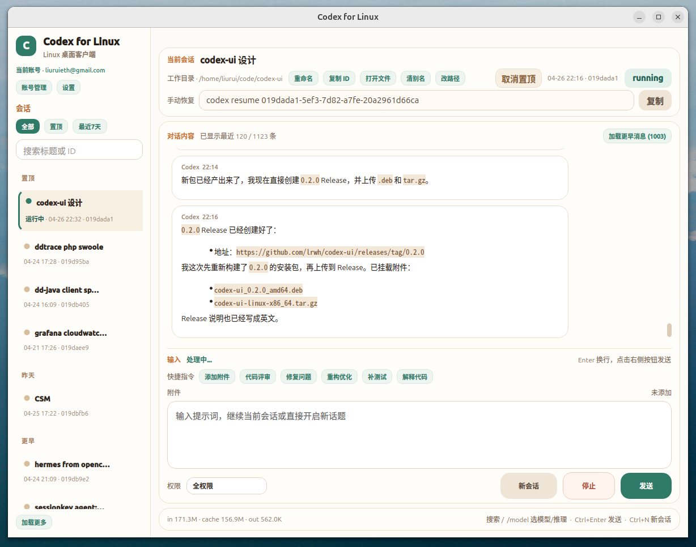

# Codex for Linux

`Codex for Linux` 是一个非浏览器形态的 Codex Linux 桌面客户端，基于本机已安装的 `codex` / `codex-auth` 工作，直接读取本地 `~/.codex` 数据，提供会话浏览、续聊、多账号管理、附件输入和桌面安装能力。



## 功能特性

- 桌面客户端：不依赖浏览器、不依赖 WebView，使用 PySide6 构建原生窗口。
- 多会话：合并读取 `~/.codex/session_index.jsonl` 与 `~/.codex/sessions/**/*.jsonl`。
- 会话续聊：新会话走 `codex exec --json`，已有会话走 `codex exec resume --json`。
- 会话管理：支持置顶、重命名、复制 ID、打开会话文件、复制 `codex resume` 命令和本地别名持久化。
- 工作目录：新会话默认使用全局工作目录；已有会话默认沿用 session 自带 `cwd`，也支持会话级单独改路径。
- 会话筛选：支持全部、置顶、最近 7 天和标题 / ID 搜索，左侧列表不会自动刷新打断当前浏览。
- 多账号：读取 `~/.codex/accounts/registry.json`，支持账号管理、切换和用量刷新。
- 账号用量：在账号管理中展示 5 小时 / 周额度剩余比例和下次刷新时间，并按余量使用颜色区分。
- 长会话优化：默认渲染最近消息，支持按批加载更早内容，降低超长会话启动和切换成本。
- 多会话并行：单个会话正在处理时，可以切换到其他会话继续输入和发送。
- 附件输入：提示词支持图片、`.log`、`.md`、`.markdown` 附件，文本附件会自动拼入 prompt。
- 剪贴板粘贴：输入框支持直接粘贴剪贴板图片，以及文件管理器里复制的本地文件附件。
- 快捷指令：内置代码评审、修复问题、重构优化、补测试、解释代码等常用提示词模板。
- 权限模式：输入区可快速切换只读、工作区、全权限，对应 Codex CLI 的 sandbox 行为。
- 模型切换：支持通过 `/model` 选择模型和推理强度，也可用 `/model gpt-5.4 high` 直接切换。
- 请求控制：支持 `Esc` 或“停止”按钮终止当前请求，失败信息会在输入区内联展示。
- 图片续聊：修复了 `resume + 图片附件` 的发送参数顺序，已有会话可直接带图继续提问。
- 状态摘要：底部展示 token 用量，并自动转换为 `K` / `M` / `B` 等可读单位。
- 本地设置：支持工作目录、权限模式、Codex 路径和输入法策略配置。

## 目录结构

```text
.
├── desktop_app.py                  # PySide6 桌面客户端入口
├── desktop_app_core.py             # 配置、数据模型和会话/账号数据读取
├── desktop_app_workers.py          # 后台任务线程
├── desktop_app_ui.py               # 对话框和复用 UI 组件
├── desktop_app_window*.py          # 主窗口和功能 mixin
├── capture_desktop.py              # 离屏截图辅助脚本
├── codex-ui.spec                   # PyInstaller 配置
├── packaging/                      # 桌面入口、图标和启动脚本
├── scripts/                        # 打包脚本
├── build.md                        # 构建与打包说明
├── README.md
└── TASKS.md
```

## 安装前提

运行前需要本机已经具备：

- Python 3.10+
- PySide6
- 已登录并可用的 `codex` CLI
- 可选：`codex-auth`，用于账号登录、账号切换和用量刷新

如果还没有安装 Python 依赖，可以使用：

```bash
python3 -m pip install PySide6 PyInstaller
```

## 安装

### 方式一：安装 `.deb` 包

如果你已经拿到构建好的安装包，可以直接执行：

```bash
sudo dpkg -i codex-ui_0.1.0_amd64.deb
```

安装后会写入：

- `/opt/codex-ui`
- `/usr/share/applications/codex-ui.desktop`
- `/usr/share/icons/hicolor/scalable/apps/codex-ui.svg`

### 方式二：使用目录包

如果你拿到的是发布目录或 `tar.gz` 包，可以解压后直接运行：

```bash
tar -xzf codex-ui-linux-x86_64.tar.gz
cd codex-ui-linux-x86_64
./run-codex-ui.sh
```

如果希望在当前用户桌面环境中注册启动入口：

```bash
./install-desktop-entry.sh
```

这会写入：

- `~/.local/share/applications/codex-ui.desktop`
- `~/.local/share/icons/hicolor/scalable/apps/codex-ui.svg`

## 启动方式

### 从源码启动

```bash
cd /home/liurui/code/codex-ui
python3 desktop_app.py
```

### 从安装包启动

安装 `.deb` 后，可以通过以下任一方式启动：

- 在应用菜单中搜索 `Codex for Linux`
- 或在终端执行 `/opt/codex-ui/run-codex-ui.sh`

首次启动会自动生成本地配置：

```text
~/.config/codex-ui/config.json
```

## 构建与打包

构建源码包、桌面目录包、`tar.gz` 和 `.deb` 的方式已移到：

- [build.md](./build.md)

## 快捷键

- `Ctrl+Enter` / `Ctrl+Return`：发送当前输入
- `Esc`：停止当前正在处理的请求，也可点击输入区右下角“停止”
- `Ctrl+N`：新建会话
- `/model`：在输入框中打开模型和推理强度选择；也可用 `/model gpt-5.4 high` 直接切换
- `/`：聚焦会话搜索
- `PgUp` / `PgDown`：会话或消息区域滚动
- `Home` / `End`：跳到会话列表首尾

## 配置说明

默认配置文件：

```text
~/.config/codex-ui/config.json
```

示例：

```json
{
  "codex_path": "codex",
  "codex_home": "~/.codex",
  "work_dir": "/home/liurui/code",
  "model": "",
  "model_reasoning_effort": "",
  "approval_policy": "on-request",
  "sandbox_mode": "workspace-write",
  "skip_git_repo_check": true,
  "recent_session_limit": 30,
  "input_method_strategy": "auto"
}
```

桌面设置面板里推荐直接使用“权限模式”，它会自动映射到底层的 `approval_policy` 和 `sandbox_mode`。

输入法策略：

- `auto`：默认策略，优先跟随当前桌面环境，必要时自动兼容 `fcitx / ibus / xim`。
- `system`：完全不改输入法环境变量，直接使用当前系统配置。
- `fcitx`：强制使用 `fcitx`。
- `ibus`：强制使用 `ibus`，并自动尝试启动 `ibus-daemon`。
- `xim`：强制使用 Qt 的 `xim` 回退模式。

## 注意事项

- `build/`、`dist/`、`release/` 属于本地构建产物，默认不会入库。
- `codex.png` 是 README 预览截图，会随源码一起提交。
- 多账号状态依赖本地 `~/.codex/accounts/registry.json`，刷新用量时会保持当前 UI 选中的账号不变。
